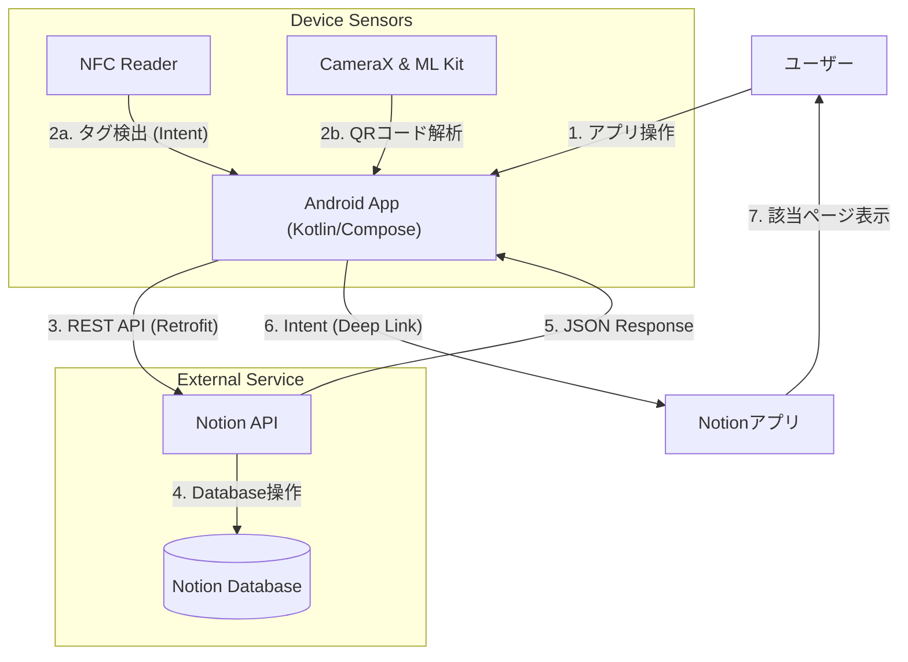
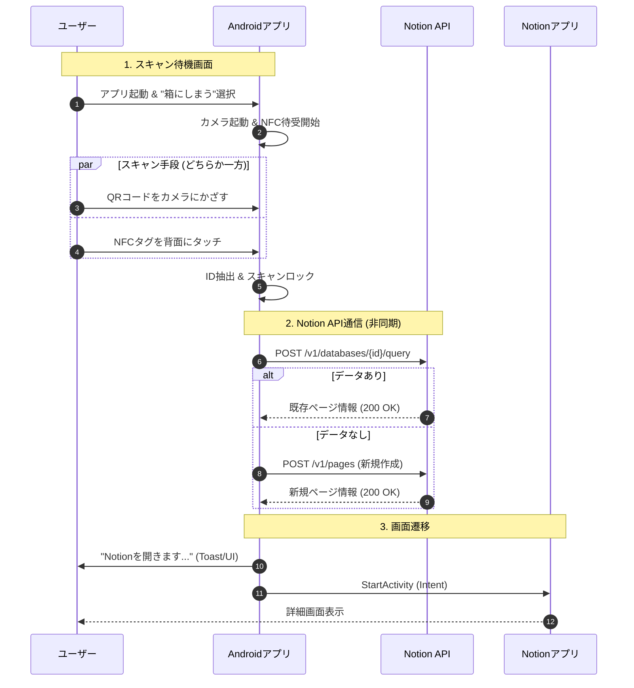

# PlamoScanner (Android) 技術仕様書

## 1. システム概要

本アプリは、Android端末のNFCリーダーとカメラ(QRコード)を同時に活用し、プラモデルの「袋」と「箱」を管理するネイティブアプリケーションです。
Web版(PWA)と異なり、サーバーサイド(GAS)を介さず、アプリから直接Notion APIを叩いてデータベースを操作します。

### 特徴
*   **ハイブリッドスキャン**: 背面タッチ(NFC)とカメラ(QR)のどちらでも即座に反応・処理を開始します。
*   **ダイレクトAPI通信**: 中間サーバーを経ず、Retrofitを用いてNotion APIと直接通信します。

### アーキテクチャ図



## 2. アプリケーションロジック詳細

### 2.1. スキャン制御 (MainActivity.kt)
NFCとQRコードの入力を **先勝ち (First-Come, First-Served)** で処理します。

*   **NFC**: `NfcAdapter.enableReaderMode` を使用し、タグ検出時にコールバックを受け取ります。
*   **QR**: `CameraX` と `ML Kit Vision` を使用し、プレビューフレーム毎に解析を行います。
*   **排他制御**: どちらかが検知された瞬間、`isScanning` フラグをロックし、二重読み取りを防ぎます。

### 2.2. Notion API連携 (Retrofit)
*   **認証**: `SecretConfig.kt` に定義された `NOTION_API_KEY` をBearer Tokenとしてヘッダーに付与します。
*   **検索ロジック**:
    1.  スキャンしたIDでデータベースを検索 (`Query`).
    2.  ヒットすればそのページIDとURLを取得。
    3.  ヒットしなければ新規ページを作成 (`Create`)。
*   **アプリ連携**: 取得したURL (`https://www.notion.so/...`) を `intent://` または `notion://` スキームに変換し、外部ブラウザ/アプリを起動するIntentを発行します。

## 3. ユーザー操作フロー (User usage flow)



## 4. iOSネイティブ化に向けた技術的検討と制約

iPhone (iOS) 向けのネイティブアプリ開発を検討する場合、Android版と同等の機能を実現するにはいくつかの重要な制約があります。

### 4.1. NFCスキャンの制約 (Critical)

| 機能 | Android | iOS (iPhone) |
| :--- | :--- | :--- |
| **読み取りモード** | 常時待機可能 | **ユーザー操作が必須** |
| **バックグラウンド** | アプリ起動中なら可 | 原則不可 (Core NFCセッションが必要) |
| **アプリ配布** | 野良アプリ(.apk)で配布可 | **App Store審査またはTestFlightが必須** |

*   **Core NFCの仕様**: iOSでNFCタグを読むには、ボタンを押して「スキャン準備完了」のシステムダイアログを表示させる必要があります。Androidのように「カメラを向けている最中に裏で勝手にNFCも読む」という**完全な双方向待機は実装できません**。
*   **配布の壁**: iOSアプリを実機にインストールするには、年間$99のApple Developer Programへの登録とApp Store審査、あるいは7日間で期限が切れる無料プロビジョニングプロファイルでのビルドが必要です。Androidのような「野良アプリ」としての永続的な運用は極めて困難です。

### 4.2. 推奨される実装方針

iOS版を作成する場合、**NFC機能はあきらめ、QRコードスキャン専用アプリとして割り切る** ことを強く推奨します。

*   **理由1**: スキャン体験の一貫性。ボタンを押してNFCモードにする手間がかかるなら、最初からカメラでQRを読むほうが早い。
*   **理由2**: 実装コストと審査リスクの回避。

### 4.3. 開発言語・フレームワークの選定

| フレームワーク | 特徴 | 推奨度 |
| :--- | :--- | :--- |
| **SwiftUI (Native)** | iOSの最新機能をフル活用可能。パフォーマンス最高。Android版とは別コードになる。 | ★★★ (iOS特化なら) |
| **Flutter** | Dart言語。Android版(Kotlin)とロジックは似ているが書き直し。UIは共通化しやすい。 | ★★☆ |
| **React Native** | JS/TS。Web版の知見が活かせる。Notion API通信部分などはWeb版から流用可能。 | ★☆☆ |

**結論**:
PWA版ですでにQRコードスキャンは実現できているため、**「どうしてもネイティブ動作させたい（オフライン対応や高速起動など）」** という強い要望がない限り、**iOSではPWA版を利用する** のが最もコストパフォーマンスが良い解となります。

## 5. 環境設定 (Android)

プロジェクト内の `SecretConfig.kt` (git管理外) にて機密情報を管理します。

```kotlin
object SecretConfig {
    const val NOTION_API_KEY = "secret_..." // Integration Token
    const val DATABASE_ID_HUKURO = "..."     // 袋DB ID
    const val DATABASE_ID_HAKO = "..."       // 箱DB ID
}
```

---
*Document generated by Antigravity Assistant*
